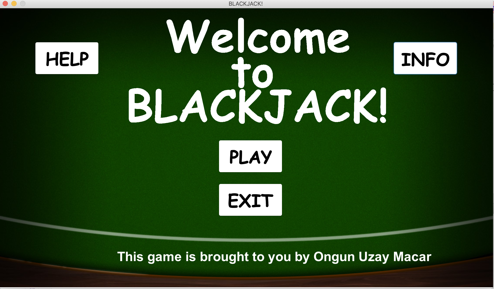

This project was done by Ongun Uzay Macar as a final project for Advanced Programming (high school class) 
in January 2016 in the guidance of Cengiz Agalar.

SCREENSHOTS:

DIRECTORIES:

src: This directory contains all the Java source files (classes) that are detailed below.
images: This directory contains images that will be displayed to the player to enhance gameplay.
sounds: This directory contains sounds that will enhance user gameplay and add in a casino ambience.

CLASSES AND DESCRIPTIONS:

Card Class: This class is for the card itself. The printCard method prints the cards which are stored in a 2D array.

Deck Class: With the deck class, we form a deck that consists of 52 cards. There are methods to shuffle, add, and remove cards.

Game Class: This class calculates the Blackjack game itself. It starts the game, forms the hands, checks the hands for a blackjack or bust.
It calculates who wins each round and what happens when a round is over.

GameComponent Class: This class is for the overall atmosphere of our game. When the user clicks the play button in OptionsComponent (menu),
this component opens with the poker table, poker chip, and the cards, and all other stuff.

OptionsComponent Class: This class is for the menu in our program. In our menu, we have some buttons.

Tester Class: The tester class is the main class of our program. It will be the main class that will run when you click run in Dr.Java 
or any other IDE that runs Java. In the Tester class, there are two threads. One of those threads are for the checking of the game which means
that the game will refresh as each round finishes and starts again. The other is for the refreshing of the JComponent (it refreshes forever).
